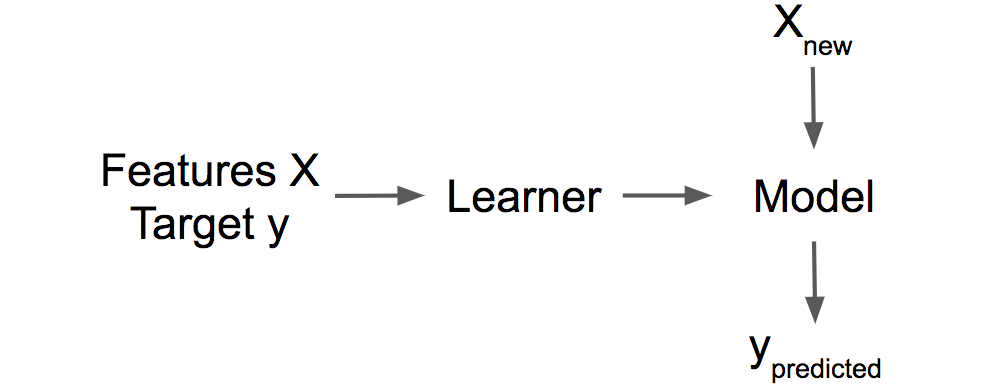

```{r include=FALSE}
knitr::opts_knit$set(root.dir = rprojroot::find_rstudio_root_file())
knitr::opts_chunk$set(kable.force.latex = TRUE)

library(mlr)
library(dplyr)
library(iml)
library(ggplot2)
library(gridExtra)
library(viridis)
library(caret)
library(e1071)
library(pdp)
library(glmnet)

set.seed(42)

source("../src/R/utils.R")
source("../src/R/get-bike-sharing-dataset.R")

bike <- get.bike.data("../dta")
get.bike.task("../dta")

logit2prob <- function(logit){
  odds <- exp(logit)
  prob <- odds / (1 + odds)
  return(prob)
}
```

## Introduction

- machine learning: An algorithm trains a model that produces the predictions.
    - explainable ml: We capture the world by collecting data, and abstract it further by learning to predict the data (for the task) with a machine learning model. Interpretability/Explainability is just another layer on top that helps humans understand.


## Terminology


```{r eval=FALSE, include=FALSE}
# - intrinsic vs post-hoc: interpretability is achieved 
#     - intrinsic: by restricting the complexity of the machine learning model that are considered interpretable due to their simple structure, such as short decision trees or sparse linear models. 
#     - post-hoc: by applying methods that analyze the model after training
#     
# - results of interpretation methods:
#     - feature summary statistic: provide summary statistics for each feature. Some methods return a single number per feature, such as feature importance, or a more complex result, such as the pairwise feature interaction strengths, which consist of a number for each feature pair.
#     - feature summary visualization: some feature summaries are actually only meaningful if they are visualized. Partial dependence plots are curves that show a feature and the average predicted outcome.
#     - Model internals: The interpretation of intrinsically interpretable models, such as weights in linear models or the learned tree structure (the features and thresholds used for the splits) of decision trees.
#     - data point: includes all methods that return data points (already existent or newly created) to make a model interpretable, i.e. counterfactual explanations, which refers to explain the prediction of a data instance, the method finds a similar data point by changing some of the features for which the predicted outcome changes in a relevant way (e.g. a flip in the predicted class). 
```

## Taxonomy of explanaible methods 
- model-specific vs. model-agnostic
    - Model-specific interpretation tools are limited to specific model classes, i.e. the interpretation of regression weights in a linear model
    - Model-agnostic tools can be used on **any** machine learning model and are applied after the model has been trained. 

- local vs. global
    - local: the interpretation method explain an individual prediction.
    - global: entire model behavior. The global level of interpretability is about understanding how the model makes decision based on a holistic view of its features and each of the learned components such as weights, other parameters, and structures. 

```{r eval=FALSE, include=FALSE}
# (Which features are important and what kind of interactions between them take place), Global model interpretability helps to understand the distribution of your target outcome based on the features.  
```

## Example dataset for regression

```{r echo=FALSE, message=FALSE, warning=FALSE}
summary(bike) 
```

## Example dataset for classification

```{r}
titanic <- read.csv("./dta/titanic_train.csv") 
titanic <- titanic %>% select(Survived, Pclass, Sex, Age, SibSp, Parch, Fare)
titanic <- titanic[complete.cases(titanic),]
titanic$Survived <- factor(titanic$Survived, levels = c("0", "1"))
titanic$Pclass <- factor(x = titanic$Pclass, levels = c("1", "2", "3"))
titanic$Sex <- factor(x = titanic$Sex, levels = c("female", "male"))
str(titanic)
```

## Model-agnostic + Global: Partial Dependence Plot (PDP)

- The PDP shows how the **average** predicted outcome of a machine learning model changes when a feature is changed by marginalizing the predicted outcome over the distribution of all the other features. 
    - A PDP shows whether the relationship between the target and a feature is *linear*, *monotonic* or *more complex*. 
    - for regression: PDP displays the change of *predicted outcome* conditionally on a feature on average
    - for classification: PDP displays the change of the *probability* for a certain class given different values of a feature on average
    
## Model-agnostic + Global: PDP (bike rental example)

```{r echo=FALSE, message=FALSE, warning=FALSE}
bike.task <- makeRegrTask(data = bike, target = "cnt")
mod.bike <-
    mlr::train(mlr::makeLearner(cl = 'regr.randomForest', id = 'bike-rf'),
               bike.task)
pred.bike <- Predictor$new(mod.bike, data = bike)
pdp <- FeatureEffect$new(pred.bike, "temp", method = "pdp")
p1 <- pdp$plot() +
    scale_x_continuous('Temperature', limits = c(0, NA)) +
    scale_y_continuous('Predicted number of bikes', limits = c(0, 5500))
pdp$set.feature("hum")
p2 <- pdp$plot() +
    scale_x_continuous('Humidity', limits = c(0, NA)) +
    scale_y_continuous('', limits = c(0, 5500))
pdp$set.feature("windspeed")
p3 <- pdp$plot() +
    scale_x_continuous('Wind speed', limits = c(0, NA)) +
    scale_y_continuous('', limits = c(0, 5500))
gridExtra::grid.arrange(p1, p2, p3, ncol = 3)
```

## Model-agnostic + Global: PDP (bike rental example)

```{r echo=FALSE, message=FALSE, warning=FALSE}
pdp <- FeatureEffect$new(pred.bike, "season", method = "pdp") 
ggplot(pdp$results) + 
  geom_col(aes(x = season, y = .value), width = 0.3) + 
  scale_x_discrete('Season') + 
  scale_y_continuous('', limits = c(0, 5500))
```

## Model-agnostic + Global: PDP (Titanic example)

```{r eval=FALSE, message=FALSE, warning=FALSE}
# fit_control <- trainControl(method = "cv",
#                            number = 5,
#                            search = "grid")
# 
# set.seed(1234)
# idx <- createDataPartition(titanic$Survived, 
#                            p = 0.8, 
#                            list = FALSE, 
#                            times = 1)
# 
# titanic_train <- titanic[idx, ]
# titanic_test <- titanic[-idx, ]
# 
# set.seed(1234)
# 
# fit <- train(
#   Survived ~ Pclass + Sex + Age + SibSp + Parch + Fare,
#   data = titanic_train,
#   method = "rf",
#   #preProcess = c("center", "scale"),
#   trControl = fit_control,
#   verbose = FALSE,
#   importance = TRUE,
#   ntree = 100
# )
# saveRDS(fit, "./model/titanic_rf.RDS")
fit <- readRDS("./model/titanic_rf.RDS")

pSex <- partial(fit, pred.var = "Sex") 
pSex$yhat <- logit2prob(pSex$yhat)
p1 <- pSex %>% 
  plotPartial(rug = FALSE, train = titanic_train, plot.engine = "ggplot2", ylab = 'Predicted survival probability', ylim = c(0, 1)) 

pPclass<- partial(fit, pred.var = "Pclass") 
pPclass$yhat <- logit2prob(pPclass$yhat)
p2 <- pPclass %>% 
  plotPartial(rug = FALSE, train = titanic_train, plot.engine = "ggplot2", ylab = 'Predicted survival probability', ylim = c(0, 1)) 

gridExtra::grid.arrange(p1, p2, ncol = 2)
```

## Model-agnostic + Global: PDP (Titanic example cont'd)

```{r eval=FALSE, message=FALSE, warning=FALSE}
pAge <- partial(fit, pred.var = "Age") 
pAge$yhat <- logit2prob(pAge$yhat)
p3 <- pAge %>% 
  autoplot(smooth = TRUE, ylab = expression(f(pAge))) +
  theme_light() +
  ylab("Predicted survival probability") + 
  ylim(c(0.1, 0.9))

pFare <- partial(fit, pred.var = "Fare") 
pFare$yhat <- logit2prob(pFare$yhat)
p4 <- pFare %>% 
  autoplot(smooth = TRUE, ylab = expression(f(Fare))) +
  theme_light() +
  ylab("Predicted survival probability") + 
  ylim(c(0.1, 0.9))

gridExtra::grid.arrange(p3, p4, ncol = 2)

```

## Model-agnostic + Global: PDP (pros & cons)
- pros: intuitive and introduce casual interpretation. The relationship shown in the PDP is **causal** for the model because we explicitly model the outcome as a function of the features (but not necessarily for the real world!)

- cons:
    - The realistic maximum number of features in a partial dependence function is two (not the drawback of the method, but the visualization)
    - Some PD plots do not show the feature distribution.
    - The assumption of **independence** is the biggest issue with PD plots. It is assumed that the feature for which the partial dependence is computed is not correlated with other features. 
    - Heterogeneous effects might be hidden because PD plots only show the average marginal effects. 
    
```{r eval=FALSE, include=FALSE}
# If the feature for which you computed the PDP is *not correlated* with the other features, then the PDPs perfectly represent how the feature influences the prediction on average. In addition, the relationship shown in the PDP is **causal** for the model because we explicitly model the outcome as a function of the features (but not necessarily for the real world!)
# 
#     - The realistic maximum number of features in a partial dependence function is two (not the drawback of the method, but the visualization)
#     - Some PD plots do not show the feature distribution.
#     - The assumption of **independence** is the biggest issue with PD plots. It is assumed that the feature(s) for which the partial dependence is computed are not correlated with other features. (Accumulated Local Effect plots or short ALE plots that work with the conditional instead of the marginal distribution.)
#     - Heterogeneous effects might be hidden because PD plots only show the average marginal effects. (individual conditional expectation curves could uneval heterogeneous effects)
```


## Model-agnostic + Local: Local Interpretable Model-agnostic Explanations (LIME)
- LIME is an implementation of local surrogate models: surrogate models are trained to approximate the predictions of the underlying black box model. 
  - Instead of training a global surrogate model, LIME focuses on training local surrogate models to explain individual predictions. The recipe is: 
  - Select an instance of interest to produce an explanation of the black box prediction.
  - Perturb the dataset and get the black box predictions for these new points.
  - Weight the new samples according to their proximity to the instance of interest.
  - Train a **weighted, interpretable model** on the dataset with the variations.
  - Explain the prediction by interpreting the local model.


```{r eval=FALSE, include=FALSE}
# - Surrogate models are trained to approximate the predictions of the underlying black box model. LIME tests what happens to the predictions when you give variations of your data into the machine learning model. LIME generates a new dataset consisting of permuted samples and the corresponding predictions of the black box model. On this new dataset LIME then trains an interpretable model, which is weighted by the proximity of the sampled instances to the instance of interest. The interpretable model can be anything from the interpretable models chapter, for example Lasso or a decision tree. 
# 
# - Select your instance of interest for which you want to have an explanation of its black box prediction.
# - Perturb your dataset and get the black box predictions for these new points, drawing from a normal distribution with mean and standard deviation taken from the feature.
# - Weight the new samples according to their proximity to the instance of interest.
# - Train a weighted, interpretable model on the dataset with the variations. (local fidelity: The learned model should be a good approximation of the machine learning model predictions locally, but it does not have to be a good global approximation.)
# - Explain the prediction by interpreting the local model.

# - Select your instance of interest for which you want to have an explanation of its black box prediction.
# - Perturb your dataset and get the black box predictions for these new points.
# - Weight the new samples according to their proximity to the instance of interest.
# - Train a weighted, interpretable model on the dataset with the variations.
# - Explain the prediction by interpreting the local model.
```


## Model-agnostic + Local: LIME (bike rental example)

```{r echo=FALSE, message=FALSE, warning=FALSE}
ntree = 100
bike.train.resid = factor(resid(lm(cnt ~ days_since_2011, data = bike)) > 0, levels = c(FALSE, TRUE), labels = c('below', 'above'))
bike.train.x = bike[names(bike) != 'cnt']
model <- caret::train(bike.train.x,
  bike.train.resid,
  method = 'rf', ntree=ntree, maximise = FALSE)
n_features_lime = 4

instance_indices = c(295, 8)
set.seed(44)
bike.train.x$temp = round(bike.train.x$temp, 2)
pred = Predictor$new(model, data = bike.train.x, class = "above", type = "prob")
lim1 = LocalModel$new(pred, x.interest = bike.train.x[instance_indices[1],], k = n_features_lime)
lim2= LocalModel$new(pred, x.interest = bike.train.x[instance_indices[2],], k = n_features_lime)
wlim = c(min(c(lim1$results$effect, lim2$results$effect)), max(c(lim1$results$effect, lim2$results$effect)))
a = plot(lim1) +
  scale_y_continuous(limit = wlim) + 
  geom_hline(aes(yintercept=0))   +
  theme(axis.title.y=element_blank(),
        axis.ticks.y=element_blank())
b = plot(lim2) +
    scale_y_continuous(limit = wlim) + 
    geom_hline(aes(yintercept=0)) +
  theme(axis.title.y=element_blank(),
        axis.ticks.y=element_blank())
grid.arrange(a, b, ncol = 1)
```

## Model-agnostic + Local: LIME (Titanic example)
- to be added

## Model-agnostic + Local: LIME (pros & cons) 
- pros
    - The local, interpretable model for explanation applies to different underlying black box machine learning models.
    - LIME works for tabular data, text and images. 
    - The explanations can be created with the original attributes. For instance, A text classifier can rely on abstract word embeddings as features, but the explanation can be based on the presence or absence of words in a sentence. 
    
```{r}
# A regression model can rely on a non-interpretable transformation of some attributes, but the explanations can be created with the original attributes. For instance, A text classifier can rely on abstract word embeddings as features, but the explanation can be based on the presence or absence of words in a sentence. 
```

- cons
    - The definition of the neighborhood computed by an exponential smoothing kernel requires users to utilize LIME with great care. For each application, the user is recommended to try different kernel settings and see if the explanations make sense. 
    - Data points are sampled from a Gaussian distribution, ignoring the **correlation** between features. This can lead to unlikely data points which can then be used to learn local explanation models.

```{r eval=FALSE, include=FALSE}
# (LIME currently uses an exponential smoothing kernel to define the neighborhood. The kernel width determines how large the neighborhood is: A small kernel width means that an instance must be very close to influence the local model, a larger kernel width means that instances that are farther away also influence the model.)
```

## Model-agnostic + Local: Shapley Value
- A prediction can be explained by assuming that each feature of an instance is a "player" in a game where the prediction is the payout. Shapley values -- a method from coalitional game theory -- tells us how to fairly distribute the "payout" among the features.
  - The interpretation of the Shapley value for a feature is: the feature contributed a certain value to the prediction of a particular instance **compared to the average prediction for the dataset**. 

```{r eval=FALSE, include=FALSE}

    # - The interpretation of the Shapley value for feature value j is: The value of the j-th feature contributed j to the prediction of this particular instance compared to the average prediction for the dataset. 
    # -       Note that: The Shapley value is *the average contribution* of a feature value to the prediction in different coalitions. The Shapley value is NOT the difference in prediction when we would remove the feature from the model.
```


## Model-agnostic + Local: Shapley Value (bike rental example)

```{r echo=FALSE, message=FALSE, warning=FALSE}
set.seed(42)
ntree = 30
bike.train.x = bike[names(bike) != 'cnt']
model <- caret::train(bike.train.x,
               bike$cnt,
               method = 'rf', ntree=ntree, maximise = FALSE)
predictor = Predictor$new(model, data = bike.train.x)
instance_indices = c(295, 285)
avg.prediction = mean(predict(model))
actual.prediction = predict(model, newdata = bike.train.x[instance_indices[2],])
diff.prediction = actual.prediction - avg.prediction
x.interest = bike.train.x[instance_indices[2],]

shapley2 = Shapley$new(predictor, x.interest = x.interest)
plot(shapley2) +  scale_y_continuous("Feature value contribution") +
  ggtitle(sprintf("Actual prediction: %.0f\nAverage prediction: %.0f\nDifference: %.0f", actual.prediction, avg.prediction, diff.prediction))  +
 scale_x_discrete("")

```

## Model-agnostic + Local: Shapley Value (Titanic example)
- to be added 


## model-agnostic + Local: Shapley Value (pros & cons)
- pros
    - the average prediction is *fairly distributed* among the feature values of the instance
- cons
  - An exact computation of the Shapley value is computationally expensive because there are 2k possible coalitions of the feature values and the "absence" of a feature has to be simulated by drawing random instances, which increases the variance for the estimate of the Shapley values estimation. 
  - Explanations created with the Shapley value method always use all the features, which is not for sparse explanations (explanations that contain few features). 
    - No prediction model returned (vs. LIME).  
    - Need access to the data.
    - In the process of drawing random instances to compute Shapley value of a given feature, the method might include unrealistic data instances when features are correlated. 
    
```{r eval=FALSE, include=FALSE}
# This means it cannot be used to make statements about changes in prediction for changes in the input, such as: "If I were to earn €300 more a year, my credit score would increase by 5 points."
#     - need to access to the data
# To simulate that a feature value is missing from a coalition, we marginalize the feature. This is achieved by sampling values from the feature's marginal distribution. This is fine as long as the features are independent. When features are dependent, then we might sample feature values that do not make sense for this instance. 
```

# Reference and materials
- Molnar, Christoph. "Interpretable machine learning. A Guide for Making Black Box Models Explainable", 2019. https://christophm.github.io/interpretable-ml-book/

- Github repo: https://github.com/jiatingchen/explainable-ml (needed to be updated)

